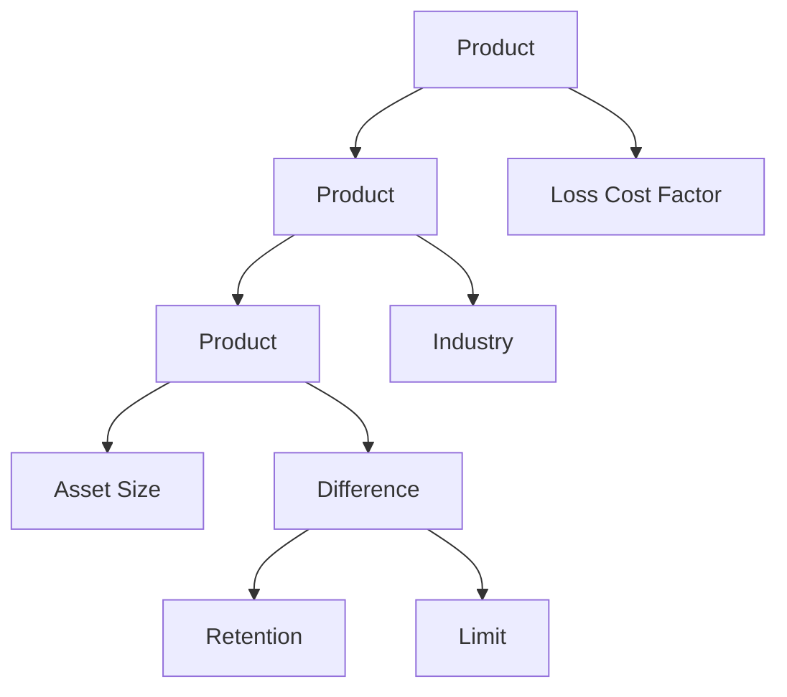

# pyrateer
Python rating engine

# Structure

## Expression Tree

Pyrateer converts a rating formula into a type of binary tree called an algebraic expression tree where terminal nodes are one of three rating factor classes: NumericFactor, CategoricalFactor, or Constant Factor. All non-terminal nodes are CompoundFactors that apply an arithmetic operator. For example, the formula `Asset Size * (Limit - Retention) * Industry * Loss Cost Factor` gets converted to the following expression tree.

When the `calculate()` method is called on the root object, it calls the `calculate()` method on its child nodes. When a terminal node is reached, the factor is returned and when a non-terminal node is reached, the CompoundFactor calls the `calculate()` method on its children.

## Rating Factors

Each rating factor must be initialized with a lookup table in the form of a dictionary to map input values to a factor value. For example, asset size would be initalized with a dictionary that lists base rates for each asset size. For numeric inputs, values between listed values can be calculated using linear interpolation. Categorical factors must have a value in the lookup that matches the input. Constant factors don't require an input and will always return the same factor.

# Implementation

Including the full lookup tables in the script for each factor can be cumbersome and create unnecessarily long Python files. To allow for reuse of a rate plan after it is defined, there are a few options

## Pickling

Use the pickle package to serialize the rate plan object for quick import and use. The `example.py` file creates the rate plan and rates a JSON string input. It then saves the rate plan to a pickle file. The `example_pickle.py` script loads the pickled rate plan, and rates the same JSON string.

## JSON Rate Plans

Future development could implement a JSON format for saving rate plan information. This is better than pickling because when the pyrateer package is updated, it could make it difficult to unpickle files that were created with older versions of pyrateer (or older versions of pickle). The JSON format is just data so updated versions of pyrateer would import the JSON into the updated package with fewer issues.

## Rate Database

Future development could also allow for pyrateer to read rating factor tables from a database and create the rate plan from those tables. Using this strategy would allow for the rating tables to be accessed for other purposes whereas the JSON could be more difficult to use in different applications. However, issues with versioning the rate tables would need to be solved and this may end up being more complicated.